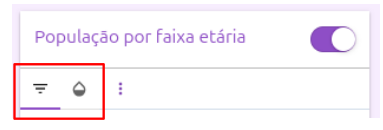
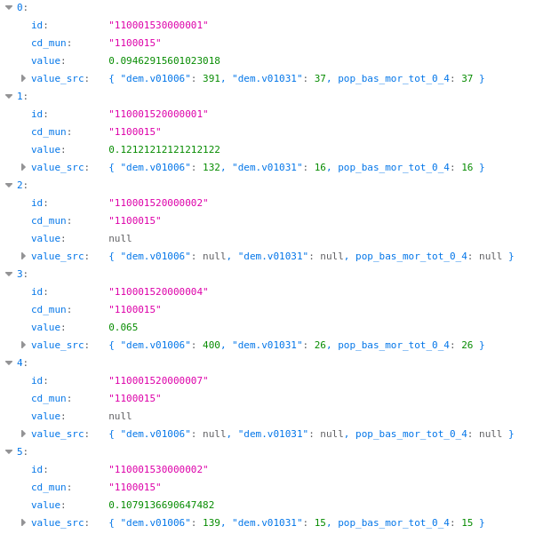

# GeoReDUS

## 📖 Sobre

Este repositório representa a biblioteca de componentes frontend desenvolvida em React para visualização e análise de dados geoespaciais urbanos do projeto GeoReDUS (Plataforma de Dados Intraurbanos da ReDUS - Rede para Desenvolvimento Urbano Sustentável). O projeto está organizado em sistema de `monorepo` (clique [aqui](https://github.com/joelparkerhenderson/monorepo-vs-polyrepo?tab=readme-ov-file#introduction) para entender o que é um monorepo).

## ⚙️ Configuração de ambiente e Instalação do Projeto

Este projeto utiliza Yarn Workspaces para gerenciar múltiplos pacotes em um único repositório.

Siga o mesmo passo a passo de **configuração de ambiente** e **instalação do projeto** do repositório `redus-web-ui` neste [link](https://github.com/orioro/redus-web-ui). Após a instalação correta do projeto continue no passo a passo abaixo.

**Obs:** No comando `yarn build` provavelmente vão aparecer alguns erros de chatbot e typescript, pode ignorar, o importante é o `dist` estar sendo criado no diretório de cada componente.

## 🚀 Desenvolvimento

### Orientação Genérica:

No projeto, usamos o padrão:

```bash
yarn workspace <name> <comando>
```

**Obs:** Verifique o `name` e os comandos do `workspace` em `package.json` no diretório de cada um em `packages`.

**Acesse: http://localhost:6006**

O Storybook exibe todos os componentes da biblioteca com exemplos interativos. Você pode explorar os componentes através dos arquivos `.stories.jsx` localizados em:

```
packages/[workspace]/src/[componente]/*.stories.jsx
```

### Aplicação para o pacote `georedus-ui`:

Primeiramente será necessário inserir configuraçoes de ambiente no arquivo `.env` dentro do diretório `georedus-ui`. Solicite as variáveis de ambiente para alguém da equipe de tecnologia:

```
STORYBOOK_METADATA_API_ENDPOINT
STORYBOOK_VECTOR_TILE_SERVER_ENDPOINT
NEXT_PUBLIC_MAP_TILER_API_KEY
STORYBOOK_RASTER_TILE_SERVER_ENDPOINT
STORYBOOK_RASTER_TILE_ROOT_PATH
```

⚠️ **Importante**: O arquivo `.env` não deve ser incluido no commit, apesar de estar no `.gitignore`, é bom ficar atento a isso.

Rode o storybook localmente:

```bash
yarn dev
```

Esse comando executa, na prática (veja o arquivo `package.json` na raiz do projeto):

```bash
yarn workspace @redus/georedus-ui dev
```

Acesse o storybook em: http://localhost:6006

Explore a biblioteca através dos arquivos: `packages/georedus-ui/src/[componente]/*.stories.jsx`

### Aplicação para o pacote `react-maplibre-util`:

Insira as configuraçoes de ambiente no arquivo `.env` dentro do diretório `react-maplibre-util`. Solicite as variáveis de ambiente para alguém da equipe de tecnologia:

```
STORYBOOK_MAP_TILER_API_KEY
```

⚠️ Importante: O arquivo .env não deve ser incluido no commit, apesar de estar no .gitignore, é bom ficar atento a isso.

Rode o storybook localmente:

```bash
yarn workspace @orioro/react-maplibre-util dev
```

Acesse o storybook em: http://localhost:6006

Explore a biblioteca através dos arquivos: `packages/react-maplibre-util/src/[componente]/*.stories.jsx`

## 📁 Estrutura do Projeto

O projeto está organizado em pacotes modulares dentro do diretório `packages/`:

### **1 - `georedus-ui`**

Componente principal da GeoReDUS:

- Interface de mapa interativo com múltiplas camadas de dados
- Visualização de dados censitários, educação, saúde e infraestrutura urbana
- Sistema de filtros e controles de visualização
- Suporte a Vector Tiles e dados raster
- Integração com Google Sheets para especificações de visualização
- Exportação e compartilhamento de visualizações

### **2 - `chatbot-poc`**

Prova de conceito de chatbot assistente para navegação e análise de dados

### **3 - `react-maplibre-util`**

Componentes React para integração avançada com o **MapLibre GL** por meio do `react-map-gl`, que atua como camada de integração entre o **MapLibre GL** e o React.

Esta biblioteca fornece um conjunto de ferramentas e componentes React construídos sobre o `react-map-gl`, adicionando funcionalidades para gestão, sobreposição, ordenação de camadas e composição de visualizações no MapLibre.

#### 📚 Recursos úteis:

Para entender melhor sobre essas duas bibliotecas consulte suas respectivas documentaçoes

- [MapLibre](https://maplibre.org/maplibre-gl-js/docs/)
- [React Map GL](https://visgl.github.io/react-map-gl/docs)

#### 🧩 Componentes:

- **Controls**

  - Controles customizados para o mapa, como navegação, inspeção e terreno.
  - Subcomponentes: `ControlContainer`, `InspectControl`, `TerrainControl`.

- **CustomSprite**

  - Sistema para sprites customizados no mapa.
  - Permite adicionar ícones e imagens personalizadas.

- **DynamicImages**

  - Renderização dinâmica de imagens e padrões SVG como preenchimento de camadas.

- **GeocoderCtrl_MapLibre**

  - Controle de geocodificação integrado ao MapLibre.
  - Suporte a APIs como Mapbox e Nominatim.

- **HoverTooltip**

  - Tooltips interativos exibindo dados das features ao passar o mouse.

- **LayeredMap**

  - Sistema de camadas para múltiplas visualizações sobrepostas.
  - Controle de ordem, visibilidade e z-index das camadas.
  - Propriedades: - `views`: propriedade chave, usadas para especificação das fontes de dados e camadas de renderizadores. - `layers`: define como renderizar os dados na tela. - `paint`: faz a estilização dos dados renderizados.

- **MapWindow**

  - Mini-mapas e janelas de visualização sincronizadas.

- **MapboxGeocoderControl**

  - Controle de busca geográfica usando Mapbox.

- **SyncedMaps**

  - Sincronização de múltiplos mapas para comparação.
  - Monta dois `LayeredMap` lado a lado para comparação ou análise sincronizada
  - Possibilita múltiplos mapas sincronizados por viewport
  - Suporte a layouts lado-a-lado ou empilhados

- **scales**

  - Utilitários para escalas de cores e símbolos.

- **useHover**

  - Hook para interação de hover em features do mapa.

- **util**
  - Funções utilitárias para manipulação de estilos, geometria e expressões.

Cada componente pode ser explorado individualmente para compor visualizações avançadas e interativas com MapLibre GL.

É possivel ver uma aplicação simples desta biblioteca em um estudo de caso feito na branch `tmp/studies` em `packages/react-maplibre-util/src/Studies/ReactMapGl.stories.jsx`.

### **4 - `react-chart-util`**

Biblioteca de componentes para visualização de dados e legendas.

- Tipos de legendas:
  - CategoricalLegend: para dados categóricos
  - ContinuousColorLegend: para escalas contínuas de cor
  - ProportionalSymbolLegend: para símbolos proporcionais
- Layout flexível com suporte a múltiplas legendas
- Integração com sistemas de cores e escalas

### **5 - `react-dir-nav`**

Biblioteca que constrói o sistema de navegação hierárquica em árvore para organização de conteúdo:

- Estrutura de diretórios com suporte a níveis aninhados, ou seja, pasta com subpasta
- Busca e filtros por conteúdo
- Seções expansíveis (Dir, DirSection, NavSection)
- Componentes customizáveis de itens e navegação

**Casos de uso:** Menu de visualizações, organização de camadas temáticas e catálogo de dados

### **6 - `vector-tile-util`**

Utilitários para manipulação e renderização de Vector Tiles:

- Protocolo de mesclagem de dados (dataMergeProtocol):
  - Combinação de tiles vetoriais com dados tabulares
  - Cache otimizado de consultas
  - Suporte a múltiplas fontes de dados
- Processamento client-side:
  - Geometrias vetoriais enviadas ao cliente
  - Renderização customizável no navegador
  - Redução significativa de tráfego de rede
  - Integração com MapLibre via protocolos customizados

**Conceito:**

Para evitar o carregamento de todos os dados de uma vez, as informações são organizadas em tiles (quadrados), cada um identificado por um sistema de coordenadas próprio: nível de zoom, eixo x e eixo y (z, x, y).

Tradicionalmente, cada tile contém uma imagem (raster tile). Já o vector tile carrega dados vetoriais. Em vez de renderizar imagens no servidor, o servidor envia ao cliente as geometrias (polígonos, linhas e pontos), que são renderizadas dinamicamente no navegador ou aplicação cliente.

Isso permite:

- Arquivos mais leves
- Transmissão mais rápida
- Customização de estilos em tempo real
- Interatividade com features individuais

Observação: Os eixos x e y serão diferentes para cada nível de zoom, uma vez que dependendo do zoom, o mapa será recortado em diferentes "tiles".

**Tecnologias:**

- MapLibre GL
- Protocol Handlers
- DuckDB (integração)

## 📌 Exemplo Prático

### ✨ Criando uma view

Uma view é criada em 5 etapas:

- Conf Schema
- Metadata
- Sources
- Layers
- Download

Cada etapa disponibiliza para as seguintes os dados que foram resolvidos anteriormente. Por fim, o **Tooltip** é carregado em tempo real, ou seja, conforme a movimentação do mouse (pode ser considerado uma sexta etapa).

Porém, antes do confSchema, cada view deve definir algumas propriedades básicas que identificam e descrevem o indicador apresentado. Essas propriedades são:

- collection_id: Identificador da coleção à qual a view pertence.
- indicator_id: Identificador único do indicador.
- id: Identificador único da view.
- label: Nome legível da view, exibido na interface.
- path: Caminho de navegação para organizar a view no menu.

Exemplo:

```jsx
{
  collection_id: 'censo_2022_example_view',
  indicator_id: 'censo_2022_example_view',
  id: 'censo_2022_example_view',
  label: 'População por faixa etária',
  path: 'População e domicílios',
}
```

#### **1 - Conf Schema**

Permite configurar **paineis de dados** e **estilos** da view



Em `data` serão feitas as configurações dos dados. Nele é possível definir as variáveis disponíveis para uma visualização específica. Por exemplo, para visualizar a população por faixa etária, podemos ter as seguintes variantes:

```jsx
confSchema: {
  data: {
    variantId: {
      type: 'treeSelect',
      label: 'Qual faixa etária?',
      options: [
        {
          label: 'Total (0-4)',
          value: 'pop_bas_mor_tot_0_4_pct',
        },
        {
          label: 'Total (5-9)',
          value: 'pop_bas_mor_tot_5_9_pct',
        },
        {
          label: 'Total (10-14)',
          value: 'pop_bas_mor_tot_10_14_pct',
        }
      ]
    }
  }
}
```

#### **2 - Metadata**

Carrega todos os dados de todo o município para conseguir calcular as **porcentagens**, **escalas de cores** e **legendas** que serão aplicadas posteriormente sobre os dados específicos de cada tile carregado.

Para isso, é necessário criar uma função que executa o *fetch* na API. Essa função deve ser envolvida pela biblioteca `resolve`, sinalizando ao sistema que ela precisa ser executada.

Exemplo para dados de moradores de 0 a 4 anos em Belém:

```jsx
import { resolveAsync } from '@orioro/resolve'

metadata: resolveAsync.fn(async (ctx) => {
  // Lê a variante selecionada pelo usuário nas opções do confSchema
  const variableId = ctx.view.conf.data.variantId
  const municipioId = '1501402'

  // Monta a URL para carregar os dados referente à variável de todo o município
  const dataUrl =
    `${METADATA_API_ENDPOINT}/cem_censo_2022_pessoas?` +
    // Solicita carregar apenas dados do município selecionado
    `cd_mun=eq.${municipioId}&` +
    // Seleciona as colunas a serem carregadas para cada setor censitário:
    // - id do setor
    // - variável
    // - ${variavel}_src
    `select=id,${variableId},${variableId}_src`

  // Faz a requisição ao servidor via fetch
  const data = await fetch(dataUrl).then((res) => res.json())

  // Separa valores da variável values
  const values = data
    .map((entry) => entry.pop_bas_mor_tot_0_4_pct)
    .filter((value) => typeof value === 'number')

  // Calcula o mínimo e o máximo dentro da escala de valores
  const min = Math.min(...values)
  const max = Math.max(...values)

  return { min, max }
})
```

No exemplo acima é retornado apenas o valor mínimo e o valor máximo na escala de dados. Porém outra solução seria usar o `colorScaleStops` juntamente com o `naturalBreaks` a fim de ter uma distribuição mais homogênea dos dados no mapa (explicações mais detalhadas sobre isso serão dadas no tópico de *layers*).

```jsx
import { COLOR_SCHEMES} from '../viewSpecs/util'

// Usa a escala de cores azul do COLOR_SCHEME
const colorScheme = COLOR_SCHEMES.schemeBlues

metadata: resolveAsync.fn(async (ctx) => {

  //...

  return {
    // Retorna a computação da escala de cores usando algoritmo de quebras naturais
    colorScaleStops: [
      // Passa os valores, o esquema de cores e a quantidade de grupos para a função `natural_breaks`
      '$naturalBreaks',
      values,
      {
        ...colorScheme,
        minK: 5,
      },
    ],
  }
})
```

#### **3 - Sources**

A seção `sources` define as fontes de dados utilizadas na visualização.  
Cada chave do objeto representa o `id` do source, e o valor é a configuração correspondente.

O protocolo `vtx` foi criado para facilitar o carregamento eficiente de dados geoespaciais. Ele permite especificar separadamente a localização da **malha vetorial** (`tiles`) e dos dados (`data`).

Para cada tile renderizado, são feitas duas requisições: uma para carregar a geometria do tile e outra para buscar os dados associados àquele tile. Em seguida, as informações são unidas no cliente, utilizando o campo `id` como chave de junção.

**Funcionamento do protocolo `vtx`:**

- Carrega a malha vetorial de um tile (`z/x/y`);
- Carrega os dados referentes exclusivamente a esse tile (`z/x/y`);

   

- Realiza o join dos dados da malha vetorial com os dados carregados, utilizando o campo `id`.

O link é definido para cada tile no formato (`z/x/y`).  
Para visualizar o conteúdo de um tile específico, basta substituir as variáveis `{z}`, `{x}` e `{y}` pelas coordenadas desejadas.

Exemplo de configuração de source utilizando o protocolo `vtx`:

```jsx
sources: {
  setores_censitarios: {
    minzoom: 8,
    tiles: [
          resolve.fn((ctx) => {
            const variableId = ctx.view.conf.data.variableId
            return [
              '$vtxUrl',
              {
                tiles: `${VECTOR_TILE_SERVER_ENDPOINT}/ibge_malha_br_setor_censitario_2022.geom/{z}/{x}/{y}`, // URL dos tiles vetoriais
                data: [
                  [
                    'id',
                    `${METADATA_API_ENDPOINT}/rpc/cem_censo_2022_data_tile?` +
                      `table_id=cem_censo_2022_pessoas&` +
                      `variable_id=${variableId}&` +
                      `z={z}&x={x}&y={y}`, // URL dos dados para o tile
                  ],
                ],
              },
            ]
          }),
        ],
  }
}
```

> **Observação:**
> O valor de `table_id` (neste exemplo, `cem_censo_2022_pessoas`) e as variáveis disponíveis para consulta dependem da fonte de dados utilizada. Para consultar as variáveis disponíveis em cada API, acesse [esta tabela de referência](https://docs.google.com/spreadsheets/d/1Y2Pt8fXzhGUA_Nhwz7vOyEZUKi6FEP71DChfYBSTa7U/edit?gid=1523585495#gid=1523585495).

#### **4 - Layers**

Define como os dados serão renderizados.

Para *vector tiles* precisa passar o `source_layer`, pois um mesmo *tile* pode conter várias camadas de dados. O `source_layer` define qual dessas camadas será renderizada, sendo possivel também definir mais de um `source_layer`.

```jsx
layers: {
  setores_censitarios_bounds: {
    zIndex: 99,
    type: 'line',
    source: 'setores_censitarios',
    'source_layers': 'ibge_malha_br_setor_censitario_2022.geom'
  },
  setores_censitarios_fill: {
    type: 'fill',
    source: 'setores_censitarios',
    'source_layers': 'ibge_malha_br_setor_censitario_2022.geom',
    paint: {
      'fill-color': [
        'interpolate',
        ['linear'],
        ['get', 'value'],
        // Utiliza os valores mínimo e máximo calculados no metadata
        resolve.fn((ctx) => {
          return ctxview.metadata.min
        }),
        'white',
        resolve.fn((ctx) => {
          return ctxview.metadata.max
        }),
        'blue'
      ],
    }
  }
}
```

No exemplo anterior, foi utilizada uma **interpolação linear**, abordagem que nem sempre é adequada para todos os conjuntos de dados.

Considere um conjunto de valores variando de **0 a 0,3** (0% a 30%). Em uma interpolação linear, a escala de cores é distribuída de forma uniforme ao longo do intervalo de valores. Por exemplo, ao dividir esse intervalo em três partes, obtêm-se as faixas **0–10%, 10–20% e 20–30%**.

No entanto, quando a distribuição dos dados é desigual — por exemplo, quando **80% dos valores estão concentrados abaixo de 10%** — a interpolação linear tende a produzir uma visualização pouco informativa. Nesse cenário, grande parte do mapa é renderizada com a mesma cor (considerando a escala utilizada), dificultando a distinção entre valores próximos dentro do intervalo de **0 a 0,1**.

Para lidar com esse tipo de distribuição, pode-se utilizar a estratégia de classificação naturalBreaks. Essa abordagem segmenta os dados em grupos com **quantidades semelhantes de elementos**, levando em consideração a distribuição real dos valores (foi feito um exemplo de uso do `naturalBreaks` no metadata).

Dessa forma, em vez de concentrar a maior parte dos dados em um único intervalo (0–10%), os valores passam a ser distribuídos em faixas mais representativas, por exemplo **0–3%, 3–5%, 5–30%**. O resultado é uma escala de cores mais equilibrada, que melhora a legibilidade e a capacidade de distinção entre os diferentes valores apresentados na visualização.

Para isso é utilizado o `colorScaleStops` gerado no metadata (segundo exemplo de retorno feito na *sessão de metadata*).

```jsx
layers: {

  //[...]

    paint: {
      // Usa as cores definidas na etapa de metadata para pintar o mapa
      'fill-color': resolve.fn((ctx) => {
        const colorExp = [
          // 'step' = escala fixa de cores
          'step',
          ['get', 'value'],
          ...ctx.view.metadata.colorScaleStops,
        ]

        return colorExp
      }),
      'fill-opacity': ['$get', 'view.conf.style.layerOpacity'],
      'fill-outline-color': 'transparent',
    }
}
```
**Legenda:**

As legendas do mapa são definidas aqui na camada de `layers`. 

Utilizando a variável `variantId` no `title` e o retorno do metadata em `steps` (neste exemplo é utilizado o `colorScaleStops`), a legenda irá sempre refletir os dados e as cores representados no mapa. 

```jsx
legends: [
  {
    type: 'SequentialColorLegend',
    title: [
      // Usa o nome da variável como título da legenda
      title: resolve.fn((ctx) => ctx.view.conf.data.variantId),
      unit: 'Unidade dos dados',
      // Usa as cores definidas na etapa de metadata como cores da legenda
      steps: resolve.fn((ctx) => {
        return ctx.view.metadata.colorScaleStops
      })
    ]
  }
]

```

**Tooltip:**

O tooltip também é definido dentro da camada de `layers`. É o último a ser renderizado, pois para ser possível ler dados da feature em que o cursor está sobre, é preciso que a resolução da expressão aguarde a conclusão da renderização do mapa (diferentemente das outras expressões definidas na view).

Existem 2 valores a serem preenchidos no tooltip: *title* e *entries*, que correspondem, respectivamente, ao título do tooltip e às informações. O entries consiste em um array de arrays onde o primeiro valor seria a etiqueta (`key`), ou seja, e o segundo valor ao que virá depois dos dois pontos (`value`).

```jsx
tooltip: {
  title: [
    // $literal é obrigatório pois previne a resolução antecipada da expressão.
    '$literal',
    [
      '$template',
      'Setor censitário ${0}',
      resolve.fn((ctx) => {
        return ctx.feature?.properties?.id
      })
    ],
  ],
  entries: [
    '$literal',
    resolve.fn((ctx) => {
      return [
        [
          'Valor',
          [
            '$literal', 
            resolve.fn((ctx) => {
              return ctx.feature?.properties?.id
            })
          ]
        ],
      ]
    }),
  ],

}
```

#### **5 - Download**

 A etapa de download permite exportar dados ou visualizações do mapa para uso externo, de forma flexível e interativa. O sistema utiliza a função `downloadResolver`, que abre um diálogo para o usuário escolher:
 
 - O formato do arquivo (CSV, GeoJSON, GPKG, KML)
 - As variáveis de dados a serem exportadas
 
 **Fluxo do download:**
 
 1. O usuário clica para baixar dados.
 2. Um diálogo é exibido, permitindo selecionar o formato e as variáveis desejadas.
 3. O sistema busca os dados conforme a seleção:
    - Para CSV, apenas dados tabulares são exportados.
    - Para formatos geoespaciais, as geometrias dos setores são incluídas.
 4. Os dados são processados e convertidos para o formato escolhido usando a biblioteca GDAL (via ogr2ogr).
 5. O arquivo é baixado automaticamente, com nome gerado dinamicamente.
 
 **Formatos suportados:**
 - CSV: dados tabulares, sem geometria
 - GeoJSON: dados geoespaciais em JSON
 - GPKG: banco de dados geoespacial compacto
 - KML: mapas em XML
 
 **Exemplo de configuração:**
 
 ```jsx
 download: downloadResolver({
   fileNameBase: [
     '$template',
     '${0}_${1}_georedus_censo_${2}',
     [
       ['$get', 'view.conf.data.variableId'],
       ['$get', 'municipioId'],
       '2022',
     ],
   ],
   mainVariableId: ['$get', 'view.conf.data.variableId'],
   availableVariableIds: [],
   fetchData: resolve.fn((ctx) => async ({ variableIds, options }) => {
     const variableId = ctx.view.conf.data.variableId
     // Monta a URL para buscar os dados tabulares
     const dataUrl =
       `${METADATA_API_ENDPOINT}/cem_censo_2022_pessoas?` +
       `cd_mun=eq.${ctx.app.municipioId}&` +
       `select=id,${variableId},${variableId}_src`
     const data = await fetch(dataUrl).then((res) => res.json())
 
     if (options.format === 'CSV') {
       // Exporta apenas dados tabulares
       return data
     }
 
     // Para formatos geoespaciais, busca geometria
     const geometriesUrl =
       `${METADATA_API_ENDPOINT}/ibge_malha_br_setor_censitario_2022?` +
       `cd_mun=eq.${ctx.app.municipioId}&` +
       `select=id,geom`
     const geometries = await fetch(geometriesUrl).then((res) => res.json())
 
     // Junta dados e geometria pelo campo 'id'
     return dataJoin([geometries, data], { key: 'id' })
   }),
 })
 ```
 
 **Como funciona o código:**
 - O usuário escolhe o formato e as variáveis no diálogo.
 - Para CSV, retorna apenas os dados.
 - Para GeoJSON, GPKG ou KML, busca também as geometrias e faz o join.
 - O arquivo é convertido e baixado automaticamente.
 - O nome do arquivo é gerado conforme a configuração (`fileNameBase`).
 
 **Dica:**
 Se quiser personalizar as variáveis disponíveis para download, basta preencher o campo `availableVariableIds`.
 
 Esse sistema permite exportar dados de forma prática, garantindo compatibilidade com diferentes ferramentas de análise geoespacial.

