## Estilizando Camadas

Para estilizar camadas do na plataforma da GeoReDUS nós usamos os parâmetros da bibliteca do [MapLibre](https://maplibre.org/maplibre-style-spec/layers/) na [tabela de Cadastro](https://docs.google.com/spreadsheets/d/1Y2Pt8fXzhGUA_Nhwz7vOyEZUKi6FEP71DChfYBSTa7U/edit?gid=1006885047#gid=1006885047)

Nesta tabela existem 4 campos de estilização:

- color
- fill
- fill_pattern
- line

### Color

Temos uma padronização de paleta de cores de acordo com o tipo de dado. Para preencher o campo `color` deve-se usar o padrão nomeDaPaleta.colors.index

- **Dados Categóricos**

  Usamos a paleta [schemePaired](https://d3js.org/d3-scale-chromatic/categorical#schemePaired) da biblioteca D3. É possível também ver a aplicação dessa paleta no [colorBrewer](https://colorbrewer2.org/#type=qualitative&scheme=Paired&n=12).

  Assim para preencher o campo colors para dados categóricos siga a tabela abaixo

  | visualização                                              | hexadecimal | código                   |
  | --------------------------------------------------------- | ----------- | ------------------------ |
  |  | `#a6cee3`   | `schemePaired.colors.0`  |
  |  | `#1f78b4`   | `schemePaired.colors.1`  |
  | 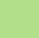 | `#b2df8a`   | `schemePaired.colors.2`  |
  |  | `#33a02c`   | `schemePaired.colors.3`  |
  | 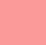 | `#fb9a99`   | `schemePaired.colors.4`  |
  |  | `#e31a1c`   | `schemePaired.colors.5`  |
  | 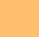 | `#fdbf6f`   | `schemePaired.colors.6`  |
  |  | `#ff7f00`   | `schemePaired.colors.7`  |
  | 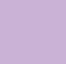 | `#cab2d6`   | `schemePaired.colors.8`  |
  |  | `#6a3d9a`   | `schemePaired.colors.9`  |
  | 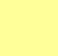 | `#ffff99`   | `schemePaired.colors.10` |
  | 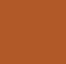 | `#b15928`   | `schemePaired.colors.11` |

### Fill

É possível customizar como será preenchida a camada, no caso de poligonos usando a coluna `fill` com a inserção de um `json`. Para isso siga os parâmetros da bibliteca [MapLibre](https://maplibre.org/maplibre-style-spec/layers/#fill).

No exemplo abaixo ele preenche zona urbana com a cor `#808080`, zona rural com a cor `#8B4513` e caso não se encaixe em nenhuma das duas categorias, preenche com a cor `#ff0000`.

```json
{
    "layout": {
        "visibility": "none"
    },
    "paint": {
        "fill-opacity": 0.4,
        "fill-color": [
            "match",
            ["get", "layer"],
            "Zona Urbana",
            "#808080",
            "Zona Rural",
            "#8B4513",
            "#ff0000"
        ]
    }
}
```

### Fill_pattern

É possível inserir hashuras na coluna `fill_pattern`, para isto basta inserir o nome de uma hachura existente no projeto, são elas:
| visualização | nome hachura |
|--------------|--------------|
| 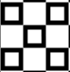 | `squares_1` |
| 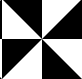 | `triangles_1` |
| 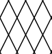 | `diamonds_1` |
| 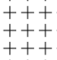 | `cross_1` |
| 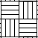 | `mosaic_1` |
| 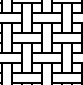 | `mosaic_2` |
| 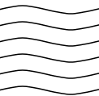 | `waves_1` |
| 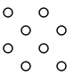 | `circles_1` |
| 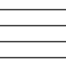 | `lines_1` |

Todas as hachuras foram extraídas de [Pattern Monster](https://pattern.monster/). Para inserir novas hachuras, será necerrário importar o svg e inseri-lo em `svgPatterns` seguindo o padrão de código dos demais.

### Line

Para customizar uma linha, é muito parecido com a customização de um preenchimento (`fill`). Siga os parâmetros da bibliteca [MapLibre](https://maplibre.org/maplibre-style-spec/layers/#line), dentro de um `json`.

No exemplo abaixo estamos definindo o preenchimento e espaçamento de uma linha tracejada, bem como sua espessura:

```json
{
    "paint": {
        "line-color": "#9f846a",
        "line-width": 5,
        "line-dasharray": [2, 4],
        "visible": "none"
    }
}
```
